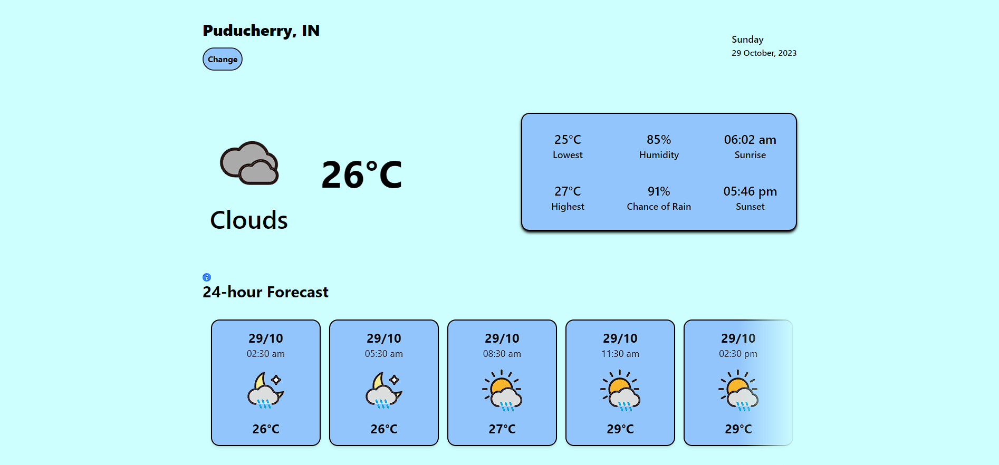
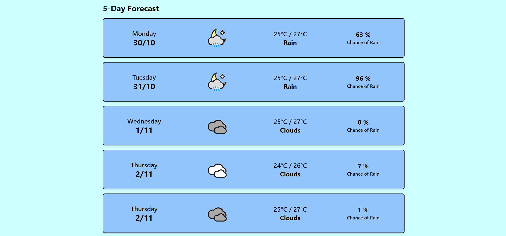

# Weather App with React

A Weather App to view current weather status and future predictions. Made using Node.js, Express.js, React.js and TailwindCSS.

## Table of Contents

- [Demo](#demo)
  - [Screenshots](#screenshots)
- [Features](#features)
- [Technologies Used](#technologies-used)
- [Running the Project Locally](#running-the-project-locally)

## Demo

You can check out the live demo of the Weather app [here](https://weather-app-client-lovat.vercel.app/).

### Screenshots




## Features

- Get current weather information for a location.
- Detailed weather data including temperature, humidity, chance of rain, min/max temperatures and sunrise/sunset times.
- Search for weather data by location name.
- Access current location.
- Responsive design for a nice user experience on both desktop and mobile devices.
- Real-time weather updates using the OpenWeatherMap API.

## Technologies Used

- [React](https://react.dev/)
- [Express.js](https://expressjs.com/)
- [Node.js](https://nodejs.org/en/about)
- [OpenWeatherMap API](https://openweathermap.org/api)
- [Geolocation API](https://developer.mozilla.org/en-US/docs/Web/API/Geolocation_API)
- Local Storage (browser)
- [TailwindCSS](https://tailwindcss.com/) for styling

## Running the Project Locally

These instructions will help you set up a copy of the project on your local machine.

### Prerequisites

Before getting started, make sure you have Node.js and npm (Node Package Manager) installed on your machine.

### Installing & Usage

1. Clone the repository to your local machine:

   ```bash
   git clone https://github.com/Krishnanand2517/weather-app.git
   ```

1. Navigate to the backend directory & install the project dependencies:

   ```bash
   cd weather-app-server
   npm install
   ```

1. Once you have installed the project and its dependencies, you can run the development server:

   ```bash
   npm start
   ```

   This will start the backend server on port 3001, and you can access it in your web browser at http://localhost:3001/.

1. Navigate to the frontend directory and install project dependencies:

   ```bash
   cd ..
   cd weather-app-client
   npm install
   ```

1. Run the development server for frontend:

   ```bash
   npm run dev
   ```

   This will start the frontend server on port 5173, and you can access the web app in your web browser at http://localhost:5173/.
